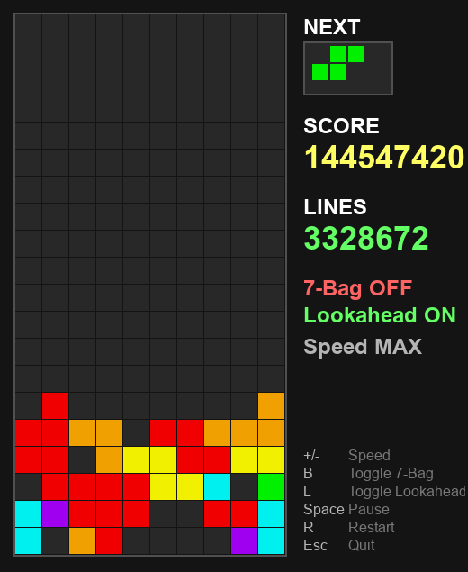

# Tetris AI Agent using the Cross-Entropy Method (CEM) 🎮

A neural network-based Tetris AI that learns to play through evolutionary optimization with no hand-crafted heuristics.

Most of the code, including the idea to use CEM, was written by Claude 4.5 Pro.

<table>
  <tr>
    <td align="center">
      <br>
      <b>First 500 lines</b><br>
    </td>
    <td align="center">
      <br>
      <b>After a few hours...</b><br>
    </td>
  </tr>
</table>

## Overview

This project demonstrates that a compact neural network (~100k parameters) can learn sophisticated Tetris strategies entirely from scratch, using only line clears as a reward signal. The agent discovers fundamental Tetris concepts like:

- 🧱 Minimizing holes and gaps
- 📏 Keeping the stack height low
- 🔮 Long-term planning and piece placement

## How It Works

### Neural Network Architecture

The agent uses a feed-forward neural network that takes the current board state as input and outputs placement scores for all possible moves. The network has approximately **100,000 trainable parameters** — small enough to evolve efficiently, yet expressive enough to capture complex game mechanics.

### Training: Cross-Entropy Method (CEM)

We use the **Cross-Entropy Method**, a gradient-free evolutionary algorithm:

1. **Population**: 200 candidate networks evaluated per generation
2. **Selection**: Top 20 elites (10%) selected based on fitness (lines cleared)
3. **Evolution**: New population generated by adding Gaussian noise to elite parameters
4. **Repeat**: Process continues until convergence

### Training Conditions

During training, agents play under **challenging conditions**:

| Setting | Value | Rationale |
|---------|-------|-----------|
| Lookahead | None | Forces learning of robust strategies |
| Piece sequence | Fully random | No 7-bag guarantees to rely on |
| Max lines | ~1,500-2,000 | Natural limit without lookahead |

These constraints ensure the network learns generalizable skills rather than exploiting specific conditions.

## Training Progress

The chart below shows fitness improvement over 228 generations of evolution (score is just lines cleared):


For timing, on the test computer (RTX 5090):

| Generation | Total training time |
|--------|-------|
| 50 | 1.5 hours |
| 100 | 10.5 hours |
| 150 | 1 day |
| 200 | 2.5 days |

## Performance Results

Adding 1-piece lookahead enables the agent to basically play indefinitely.

| Piece Mode | Performance | Generations Needed |
|-------|-------|-------|
| 7-bag | ∞ (indefinite play) | ~50 |
| Random pieces | ∞ (3M+ lines tested) | ~100 |

## How Lookahead Works

Without lookahead, the agent directly scores each possible placement of the current piece:

```
Current Piece: T

Board → NN → Scores for all T placements → Best move
```

With 1-piece lookahead, we evaluate all combinations of current + next piece:

```
Current: T, Next: I

For each T placement:
    For each I placement:
        Board → NN → Score
```

This simple addition multiplies the agent's effective intelligence.

## Quick Start

### Installation

```bash
git clone https://github.com/barrycohen/tetris-cem.git
cd tetris-cem
pip install -r requirements.txt
```

### Train Your Own Agent

Training benefits greatly from a GPU.

This will save `tetris_cem_best.npz` if the latest generation is the best one and `tetris_cem_genxxxx.npz` every 25 generations.

```bash
# Remove saved model so training starts from scratch, otherwise it will continue from the latest saved model.
rm tetris_cem_best.npz
python train.py
```

### Watch the AI Play

This will pick up `tetris_cem_best.npz`.

```bash
python play.py
```

## Why No Heuristics?

Traditional Tetris AIs rely on hand-crafted heuristics like:
- Aggregate height penalty
- Hole count penalty
- Bumpiness penalty
- Line clear reward

While effective, this approach has limitations:
1. **Requires domain expertise** to design good features
2. **Weights must be tuned** (often manually)
3. **May miss emergent strategies** not captured by features

Our approach lets the network discover its own internal representations. The ~100k parameters encode whatever features are useful for survival — learned, not designed.

